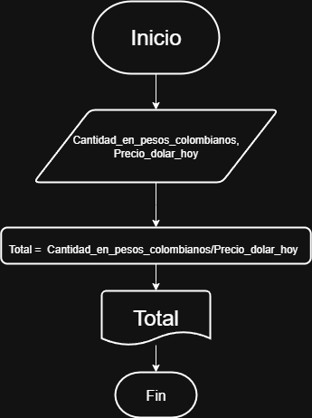

# Ejercicio

- Crear un pseudocodigo y un diagrama de flujo de un programa que quiere, ingrsando el ID y 6 salarios mensuales imprima la sumatoria de los salarios y el promedio de salario mensual.

Solución


 ## Pseudocódigo


```
Incio
Leer ID, S1, S2, S3, S4, S5, S6
Total = S1 + S2 + S3 + S4 + S5
Promedio = Total/6
Mostrar ID, Total, Promedio
Fin
```
## Diagrama de Flujo


- Una empresa importadora desea determinar cuantos dólares puede adquirir con equis cantidad de dinero colombiano. Realice un diagrama de flujo y pseudocódigo que represente para tal fin.

Solución

## Pseudocódigo

```
Leer Cantidad_en_pesos_colombianos, Precio_dolar_hoy
Total = Cantidad_en_pesos_colombianos/Precio_dolar_hoy
Mostrar Total
Fin
``` 
## Diagrama de flujo


