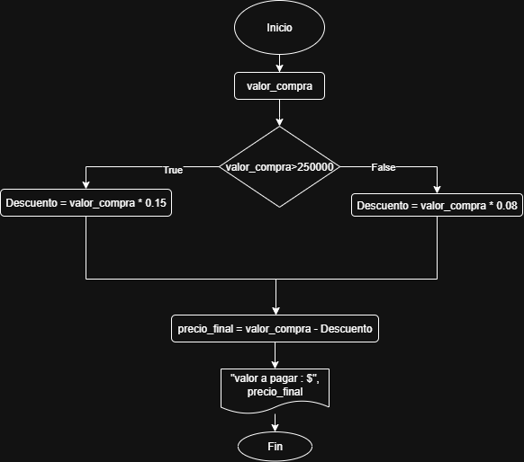
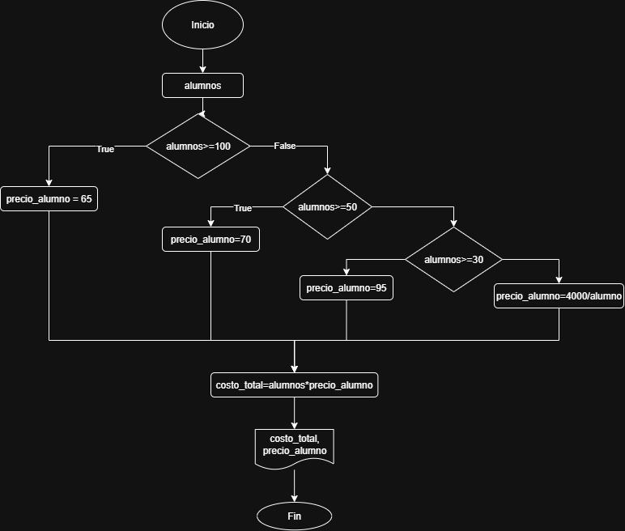
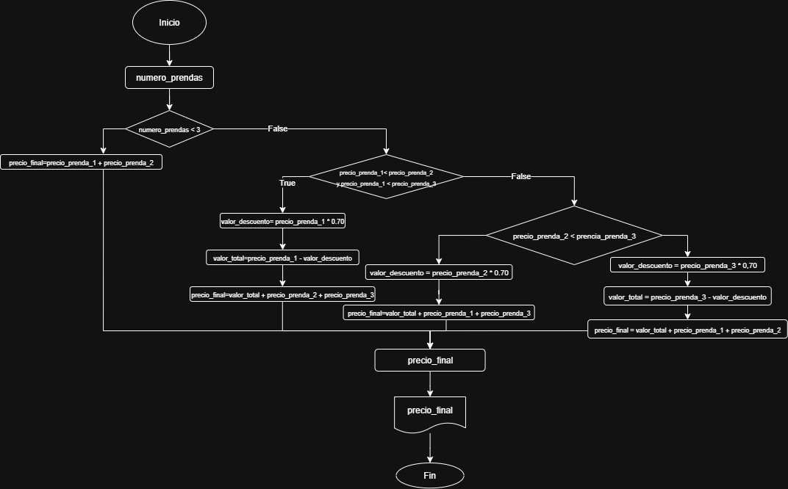

# Sesión 3
# Ejercicio 1:

- Realice un algoritmo para determinar cuanto se debe pagar por equis cantidad de lápices considerando que si son 1000 o más el costo es $85 cada uno; de lo contrario, el precio es de $90. Represéntelo con el pseudocódigo y el diagrama de flujo.

## Análisis

| Variables de entrada | Descripción |
|----------------------|-------------|
|cant_lapices| Cuántos lápices se compran|

|Variables de salida | Descripción|
|--------------------|------------|
|precio| Valor que hay que pagar|

|Variables intermedias | Descripción |
|----------------------|-------------|
|valor_unitario | usadas dentro del código | 

| Constantes | Descripción |
|------------|-------------|
|1000| Cantidad límite de lápices|
|$85,$90| Valor individual según la cantidad|

## Pseudocódigo

```
Inicio
Leer cant_lapices
Si cant_lapices >=1000
    valor_unitario = 85
Si no
    valor_unitario = 90
Fin Si
precio = valor_unitario * cantidad_lapices
Mostrar "valor total", precio
Fin
```
## Diagrama de flujo


# Ejercicio 2

- Un almacén de ropa tiene una promoción: por compras superiores a $250000 se les aplicará un descuento del 15%, de caso contrario, solo se aplicará el 8% de descuento. Realice un algoritmo para determinar el precio final que debe pagar una persona por comprar en dicho almacén y de cuánto es el descuento que obtendrá. Representelo mediante el pseudocódigo y el diagrama de flujo.

## Análisis

| Variables de entrada | Descripción |
|----------------------|-------------|
|valor_compra | Costo parcial de las prendas|

|Variables de salida | Descripción|
|--------------------|------------|
|precio_final | Valor que hay que pagar| 

| Constantes | Descripción |
|------------|-------------|
|250000| precio con descuento máximo|
|15%,8%| Descuentos|

## Pseudocódigo

```
Inicio
Leer valor_compra
Si valor_compra > 250000
   precio_final = valor_compra * 0.15
Si no
   precio_final = valor_compra * 0.08
Fin Si
precio_final = valor_compra - descuento
Mostrar "Valor a pagar:$", precio_final
Fin
```
## Diagrama de flujo




# Ejercicio 3

- El Director de una escuela esta organizando un viaje de estudios, y requiere determinar cuánto debe cobrar a cada alumno y cuanto debe pagar a la compañia de viajes por el servicio. La forma de cobrar es la siguiente:

  - Si son 100 alumnos o más, el costo por alumno es de $65.
  - Si son entre 50 a  99 alumnos, el costo por alumno es de $70.
  - Si son entre 30 y 49 alumnos,  El costo por alumno es de $95.
  - si son menos que 30, el costo es de $4000.

## Pseudocódigo
```
Inicio
Leer alumnos
Si alumnos >=100
   precio_alumno = 65
Si no 
   Si alumnos >= 50
     precio_alumno = 70
   Si no
     Si alumnos >=30
     precio_alumno = 95
     Si no precio_alumno = 4000/alumnos
Fin Si
costo_total = alumnos*precio_alumno
Mostrar costo_total, precio_alumno
Fin
```

## Diagrama de flujo



# Ejercicio 4

- Una tienda de ropa tiene la siguiente promoción: por la compra de tres productos, la prenda de menor valor, tiene un 70% de descuento. Calcular cuál fue el descuento aplicado y cuánto tiene que pagar la persona.

## Análisis

| Variables de Entrada| Descripción |
|---------------------|-------------|
|numero_prendas| Cantidad de prendas que hay|
|precio_prenda_1| precio de prenda|
|precio_prenda_2| precio de prenda|
|precio_prenda_3| precio de prenda|

|Variables de salida | Descripción|
|--------------------|------------|
|precio_final| Valor que hay que pagar|

|Variables intermedias | Descripción |
|----------------------|-------------|
|valor_descuento | usadas dentro del código |
|valor_ total| usadas dentro del código |


| Constantes | Descripción |
|------------|-------------|
|3| Cantidad de prendas|
|70%| Descuento|

## Pseudocódigo

```
Inicio
Leer numero_prendas
Si numero_prendas <3
   precio_final= precio_prenda_1 + precio_prenda_2
Si no
   Si precio_prenda_1 < precio_prenda_2 y precio_prenda_1 < precio_prenda_3
      valor_descuento = Precio_prenda_1 * 0.70
      valor_total = precio_prenda_1 - valor_descuento
      precio_final = valor_total + precio_prenda_2 + Precio_prenda_3
    Si no
      Si precio_prenda_2 < precio_prenda_3
          valor_descuento = precio_prenda_2 * 0.70 
          valor_total= precio_prenda_2 - valor_descuento
          precio_final = valor_total +precio_prenda_1 + precio_prenda_3
      Si no
          valor_descuento = precio_prenda_3 *0.70
          valor_total= precio_prenda_3 - valor_descuento
          precio_final = valor_total + precio_prenda_1 + precio_prenda_2
Fin Si
Leer precio_final
Mostrar precio_final
Fin
```

## Diagrama de flujo

